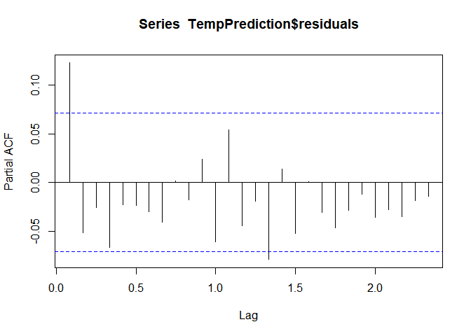
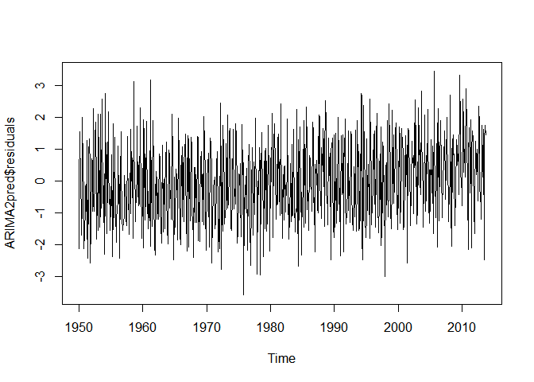

# REDWINE ANALYSIS
MAHALAKSHMI  


###Loading the data 

The CSV file containing all the data points is loaded.
The data contains date points/Average temperature and the country names.


### FILTERING THE DATA
Head function is used to understand the dataset.
The data pertaining to India is filtered using the dplyr package


### CREATING A TS VARIABLE

Creating a TS variable using the filtered Indian temperatures using the TS 
command and setting the start and end accordingly.
A Further subset of the data from 1950 is considered for the prediction purpose.

<!-- --><!-- -->

From the above plot  it can be seen that there is a seasonality component (which is constant) but not sure if there is a trend.Hence decomposing the same to find out the trend part.

<!-- -->

The decompose  plot shows a clear trend(upward) and the seasonality remains constant.
We can go ahead with the Holt-Winters Exponential model with alpha,Beta nad Gamma parameters


```
## [1] 267.7099
```

<!-- -->

Let us check the residuals to find if they are any significant corelation using the acfa nd PACF plots.

<!-- --><!-- --><!-- -->

Rechecking the co-relation using box test


```
## 
## 	Box-Ljung test
## 
## data:  TempPrediction$residuals
## X-squared = 30.378, df = 20, p-value = 0.06395
```

As per box test there seems to be a corelation in the residuals , the above Holt-winters may not be appropriate and hence we can go for ARIMA models

<!-- -->

```
## Series: TempTS3 
## ARIMA(3,0,3)(0,0,2)[12] with non-zero mean 
## 
## Coefficients:
##          ar1      ar2      ar3      ma1      ma2      ma3    sma1    sma2
##       1.0922  -0.0550  -0.4403  -0.1839  -0.3987  -0.0848  0.4852  0.3782
## s.e.  0.3042   0.4922   0.2708   0.2996   0.2241   0.0460  0.0415  0.0325
##          mean
##       24.3291
## s.e.   0.0585
## 
## sigma^2 estimated as 1.129:  log likelihood=-1131.7
## AIC=2283.4   AICc=2283.69   BIC=2329.8
```

The auto.Arima command suggest a 3,0,3 model.
The plot looks stationary hence we can gor for a ARIMA model with d=0
Checking for p and q values

<!-- --><!-- -->

Applying ARIMA(2,0,0) and ARIMA(3,0,3) to get the best fit


Analysing both ARIMA1((2,0,0) and ARIMA2((3,0,3) as below

<!-- --><!-- -->

```
## 
## 	Box-Ljung test
## 
## data:  ARIMA1pred$residuals
## X-squared = 0.84678, df = 1, p-value = 0.3575
```

<!-- --><!-- -->

Above does not seem to be the best choice as per the values in the Box - test and the plots

Checking for ARIMA2(3,0,3) as suggested by the auto function

<!-- --><!-- -->

```
## 
## 	Box-Ljung test
## 
## data:  ARIMA2pred$residuals
## X-squared = 0.076686, df = 1, p-value = 0.7818
```

<!-- --><!-- -->

The higher P-Value indiucates that actually there is no corelation between the residulas and hence the above model ARIMA(3,0,3) is the best choice and the prediction values are as below


```
##          Point Forecast    Lo 80    Hi 80    Lo 95    Hi 95
## Oct 2013       24.63432 23.00321 26.26542 22.13975 27.12888
## Nov 2013       22.13249 19.45207 24.81291 18.03315 26.23184
## Dec 2013       20.32999 17.27932 23.38066 15.66440 24.99558
## Jan 2014       19.91601 16.86156 22.97046 15.24463 24.58739
## Feb 2014       20.80305 17.59088 24.01521 15.89047 25.71563
## Mar 2014       22.59120 18.94317 26.23922 17.01203 28.17037
## Apr 2014       24.66362 20.55799 28.76926 18.38460 30.94265
## May 2014       26.39670 22.03122 30.76218 19.72027 33.07313
## Jun 2014       27.33700 22.91442 31.75959 20.57324 34.10076
## Jul 2014       27.31052 22.88440 31.73664 20.54135 34.07969
## Aug 2014       26.43912 21.92100 30.95724 19.52926 33.34899
## Sep 2014       25.07089 20.37150 29.77029 17.88379 32.25800
## Oct 2014       23.65422 18.78768 28.52076 16.21149 31.09695
## Nov 2014       22.59827 17.65289 27.54365 15.03496 30.16158
## Dec 2014       22.16108 17.20722 27.11494 14.58481 29.73736
## Jan 2015       22.39398 17.43025 27.35771 14.80261 29.98535
## Feb 2015       23.15140 18.13055 28.17224 15.47267 30.83012
## Mar 2015       24.15560 19.04935 29.26185 16.34626 31.96494
## Apr 2015       25.09144 19.91986 30.26302 17.18219 33.00068
## May 2015       25.70049 20.50590 30.89509 17.75605 33.64494
## Jun 2015       25.84797 20.65306 31.04289 17.90304 33.79291
## Jul 2015       25.54646 20.34051 30.75241 17.58465 33.50827
## Aug 2015       24.93492 19.69546 30.17439 16.92186 32.94799
## Sep 2015       24.22418 18.94500 29.50335 16.15038 32.29797
## Oct 2015       23.62835 18.32457 28.93214 15.51692 31.73979
## Nov 2015       23.30354 17.99409 28.61298 15.18344 31.42363
## Dec 2015       23.31018 18.00041 28.61994 15.18959 31.43077
## Jan 2016       23.60718 18.28840 28.92596 15.47281 31.74156
## Feb 2016       24.07563 18.73845 29.41281 15.91312 32.23815
## Mar 2016       24.56185 19.20704 29.91666 16.37237 32.75133
## Apr 2016       24.92527 19.56190 30.28865 16.72270 33.12784
## May 2016       25.07693 19.71261 30.44125 16.87290 33.28095
## Jun 2016       24.99867 19.63331 30.36404 16.79305 33.20430
## Jul 2016       24.73999 19.36841 30.11156 16.52487 32.95510
## Aug 2016       24.39587 19.01484 29.77690 16.16630 32.62544
## Sep 2016       24.07443 18.68604 29.46281 15.83360 32.31526
## Oct 2016       23.86451 18.47348 29.25553 15.61965 32.10937
## Nov 2016       23.81271 18.42164 29.20377 15.56779 32.05763
## Dec 2016       23.91508 18.52278 29.30737 15.66827 32.16188
## Jan 2017       24.12423 18.72813 29.52033 15.87161 32.37685
## Feb 2017       24.36798 18.96733 29.76863 16.10839 32.62756
## Mar 2017       24.57281 19.16931 29.97632 16.30887 32.83676
## Apr 2017       24.68501 19.28084 30.08918 16.42005 32.94997
## May 2017       24.68357 19.27937 30.08778 16.41856 32.94859
## Jun 2017       24.58235 19.17711 29.98758 16.31575 32.84894
## Jul 2017       24.42196 19.01460 29.82933 16.15212 32.69181
## Aug 2017       24.25509 18.84567 29.66451 15.98210 32.52808
## Sep 2017       24.13002 18.71959 29.54044 15.85549 32.40455
```

