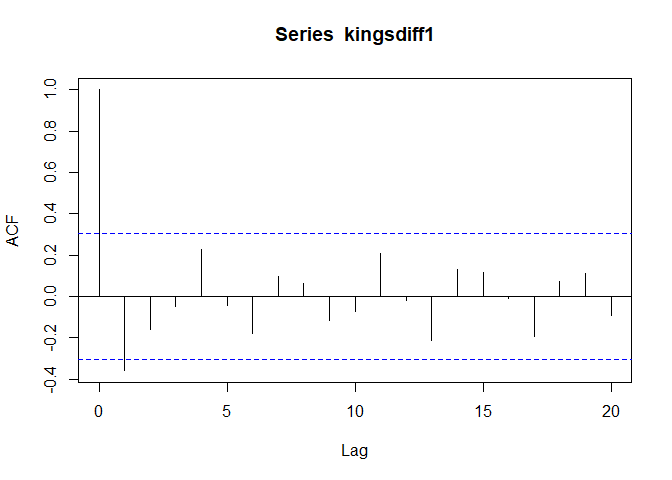

# TIME-SERIES ANALYSIS- EXPLORATORY STUDY
MAHALAKSHMI  
<https://a-little-book-of-r-for-time-series.readthedocs.io/en/latest/src/timeseries.html>


Reading the data and converting into a TS object


Plotting the read data

KingsTS can best be explianed by an additive model since the seasonal variations are random

<!-- -->

Birth plot can be explained best by an additive model since the seasonal variation is constant

<!-- -->

The Plot of Souvenior has seasonal fluctuations and hence can be best explained by a multiplicative model (the amplitude of seasonal variance is not constant)

<!-- -->

To convert a multiplicative model into a additive model take logarithms and the seasonality amplitude looks constant

<!-- -->


For a non seasonal data the trend can be explained by a simple moving average

<!-- --><!-- -->


Decomposing : Means getting the trend,Seaonality and error

<!-- -->

Decomposing a Multiplicative series- by subtracting the seasonality.Decompose is used to understand the trend without the effect of seasonality

<!-- --><!-- -->

Simple Exponential smoothing : no trend and no seasonality

<!-- -->

### SIMPLE EXPONENTIAL SMOOTHING
Forecasting the above using HoltWinters.Simple exponential smoothing can be used for the above


```
## Holt-Winters exponential smoothing without trend and without seasonal component.
## 
## Call:
## HoltWinters(x = rainTS, beta = FALSE, gamma = FALSE, l.start = 23.56)
## 
## Smoothing parameters:
##  alpha: 0.02412151
##  beta : FALSE
##  gamma: FALSE
## 
## Coefficients:
##       [,1]
## a 24.67819
```

```
## Time Series:
## Start = 1814 
## End = 1912 
## Frequency = 1 
##          xhat    level
## 1814 23.56000 23.56000
## 1815 23.62054 23.62054
## 1816 23.57808 23.57808
## 1817 23.76290 23.76290
## 1818 23.76017 23.76017
## 1819 23.76306 23.76306
## 1820 23.82691 23.82691
## 1821 23.79900 23.79900
## 1822 23.98935 23.98935
## 1823 23.98623 23.98623
## 1824 23.98921 23.98921
## 1825 24.19282 24.19282
## 1826 24.17032 24.17032
## 1827 24.13171 24.13171
## 1828 24.10442 24.10442
## 1829 24.19549 24.19549
## 1830 24.22261 24.22261
## 1831 24.24329 24.24329
## 1832 24.32812 24.32812
## 1833 24.21938 24.21938
## 1834 24.23290 24.23290
## 1835 24.13369 24.13369
## 1836 24.13867 24.13867
## 1837 24.21782 24.21782
## 1838 24.10257 24.10257
## 1839 24.04293 24.04293
## 1840 24.12608 24.12608
## 1841 24.01280 24.01280
## 1842 24.18448 24.18448
## 1843 24.15808 24.15808
## 1844 24.19889 24.19889
## 1845 24.16153 24.16153
## 1846 24.12748 24.12748
## 1847 24.18133 24.18133
## 1848 24.02499 24.02499
## 1849 24.16454 24.16454
## 1850 24.13476 24.13476
## 1851 24.01621 24.01621
## 1852 23.93453 23.93453
## 1853 24.20964 24.20964
## 1854 24.25018 24.25018
## 1855 24.11509 24.11509
## 1856 24.08964 24.08964
## 1857 24.04430 24.04430
## 1858 23.99933 23.99933
## 1859 23.87319 23.87319
## 1860 23.97780 23.97780
## 1861 24.17710 24.17710
## 1862 24.13110 24.13110
## 1863 24.21405 24.21405
## 1864 24.15075 24.15075
## 1865 23.97658 23.97658
## 1866 24.10933 24.10933
## 1867 24.29001 24.29001
## 1868 24.33729 24.33729
## 1869 24.31468 24.31468
## 1870 24.34134 24.34134
## 1871 24.26847 24.26847
## 1872 24.28659 24.28659
## 1873 24.51752 24.51752
## 1874 24.47295 24.47295
## 1875 24.33660 24.33660
## 1876 24.43558 24.43558
## 1877 24.47717 24.47717
## 1878 24.56625 24.56625
## 1879 24.79573 24.79573
## 1880 25.01341 25.01341
## 1881 25.14045 25.14045
## 1882 25.20750 25.20750
## 1883 25.25411 25.25411
## 1884 25.23351 25.23351
## 1885 25.11571 25.11571
## 1886 25.15248 25.15248
## 1887 25.19729 25.19729
## 1888 25.05286 25.05286
## 1889 25.11768 25.11768
## 1890 25.08710 25.08710
## 1891 24.99407 24.99407
## 1892 25.07019 25.07019
## 1893 25.01085 25.01085
## 1894 24.88515 24.88515
## 1895 24.95884 24.95884
## 1896 24.87469 24.87469
## 1897 24.84201 24.84201
## 1898 24.79420 24.79420
## 1899 24.62284 24.62284
## 1900 24.57259 24.57259
## 1901 24.54141 24.54141
## 1902 24.48421 24.48421
## 1903 24.39631 24.39631
## 1904 24.72686 24.72686
## 1905 24.62852 24.62852
## 1906 24.58852 24.58852
## 1907 24.58059 24.58059
## 1908 24.54271 24.54271
## 1909 24.52166 24.52166
## 1910 24.57541 24.57541
## 1911 24.59433 24.59433
## 1912 24.59905 24.59905
```

Plotting the forecast against the actual data

<!-- -->

```
## [1] 1828.855
```

Making forecast for the next 8 periods.


Plotting the predicted forecast with a 80% and 95% confidence interval

<!-- -->

Getting the Correlogram of the residuals.If there is no corelation between the plotted acf's then the model cannot be improved.

<!-- -->

As per the above the plot Lag -3 is just touching the significane boundary.This can be further checked using the Ljung-Box Test


```
## 
## 	Box-Ljung test
## 
## data:  rainforecast2$residuals
## X-squared = 17.401, df = 20, p-value = 0.6268
```

The p-value closer to 0 means there is a non-zero auto corealtion within the lags which is not the case in the above.Also the same can be checked by plotting the residuals to check for a zero mean and a constant variance

<!-- -->

## HOLTS EXPONENTIAL SMOOTHING

If there is trend and no seasonality then the above is used.

Trying out with the births data


```
## Holt-Winters exponential smoothing with trend and without seasonal component.
## 
## Call:
## HoltWinters(x = skirtsTS, gamma = FALSE)
## 
## Smoothing parameters:
##  alpha: 0.8383481
##  beta : 1
##  gamma: FALSE
## 
## Coefficients:
##         [,1]
## a 529.308585
## b   5.690464
```

Plotting the forecast

<!-- -->

Making Forecast

<!-- -->

Testing the Possibility of betterment of the chosen method using ACF/Box-Lfung test and Plotting the residuals

<!-- -->

```
## 
## 	Box-Ljung test
## 
## data:  skirtsForecast2$residuals
## X-squared = 19.731, df = 20, p-value = 0.4749
```

<!-- -->

## HOLT WINTERS EXPONENTIAL SMOOTHING

The parameters alpha, beta and gamma all have values between 0 and 1, and values that are close to 0 mean that relatively little weight is placed on the most recent observations when making forecasts of future values.

The Souvenir data looked like a multiplicative model beacuse of the seasonality rise.However the same can be converted to an additive model by taking Logarithms.


```
## Holt-Winters exponential smoothing with trend and additive seasonal component.
## 
## Call:
## HoltWinters(x = souvenirlog)
## 
## Smoothing parameters:
##  alpha: 0.413418
##  beta : 0
##  gamma: 0.9561275
## 
## Coefficients:
##            [,1]
## a   10.37661961
## b    0.02996319
## s1  -0.80952063
## s2  -0.60576477
## s3   0.01103238
## s4  -0.24160551
## s5  -0.35933517
## s6  -0.18076683
## s7   0.07788605
## s8   0.10147055
## s9   0.09649353
## s10  0.05197826
## s11  0.41793637
## s12  1.18088423
```

<!-- -->

Forecasting for the next 48 months

<!-- -->

Checking the residual plot and the box method and ACF

<!-- -->

```
## 
## 	Box-Ljung test
## 
## data:  souvenirforecast2$residuals
## X-squared = 17.53, df = 20, p-value = 0.6183
```

<!-- -->

Based on the above we can conclude that the model is adequate in predicting the forecast.

## ARIMA model

In cases where the residual plot does not have a zero mean and a constant 
variance ARIMA models are helpful.

Using the Skirt data

Differentiating the same to arrive at a stationary TS

<!-- -->


Differentiating once again since the above does not look stationary

<!-- -->

The above looks stationary hence we can proceed with the ARIMA(p,d,q) model.The order of differencing d for this case is 2.

<!-- --><!-- -->

Both the ACF and PACF do not abruptly tail off and hence we can go for the ARIMA model(2,2,2).Also we can use the auto.ARIMA () to find the appropriate model

Another example


```
## Series: skirtsTS 
## ARIMA(1,2,0)                    
## 
## Coefficients:
##           ar1
##       -0.2997
## s.e.   0.1424
## 
## sigma^2 estimated as 397.8:  log likelihood=-193.66
## AIC=391.33   AICc=391.62   BIC=394.9
```

<!-- --><!-- --><!-- --><!-- -->

```
## Series: kingsTS 
## ARIMA(0,1,1)                    
## 
## Coefficients:
##           ma1
##       -0.7218
## s.e.   0.1208
## 
## sigma^2 estimated as 236.2:  log likelihood=-170.06
## AIC=344.13   AICc=344.44   BIC=347.56
```

Getting the ARIMA values and forecast

<!-- --><!-- --><!-- --><!-- -->

```
## 
## 	Box-Ljung test
## 
## data:  kingsArimaForecast$residuals
## X-squared = 13.584, df = 20, p-value = 0.8509
```

<!-- -->

Example of Volcanic dust Veil in Northern Hemisphere

<!-- --><!-- --><!-- -->

```
## Series: volcanoTS 
## ARIMA(2,0,0) with non-zero mean 
## 
## Coefficients:
##          ar1      ar2     mean
##       0.7533  -0.1268  57.5274
## s.e.  0.0457   0.0458   8.5958
## 
## sigma^2 estimated as 4901:  log likelihood=-2662.54
## AIC=5333.09   AICc=5333.17   BIC=5349.7
```
Forecasting using the suggested models

<!-- --><!-- --><!-- --><!-- -->

```
## 
## 	Box-Ljung test
## 
## data:  volcanoforecast$residuals
## X-squared = 0.045651, df = 1, p-value = 0.8308
```

The p-Value of over 0.8 suggests that the model chosen is appropriate
